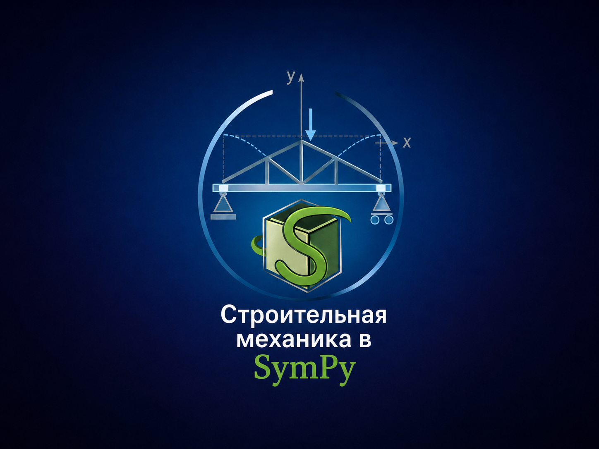

# 🏗️ Строительная механика в символьных вычислениях

> «Ку? Знакомые формулы — по-новому с SymPy.»
> *Кин-дза-дза!, 1986*

Практические примеры расчётов балок и ферм на Python и SymPy.



## 📐 Возможности

| Возможность | Статус |
|-------------|--------|
| Балки | ✅ |
| Плоские фермы | ✅ |
| Построение эпюр `M`, `Q`, `N` | ✅ |
| Символьные и численные расчёты | ✅ |
| Арки | 🚧 |
| Тросы | 🚧 |
| Колонны | 🚧 |
| 2D рамы | 🚧 |

[](LICENSE)
[](https://sympy.org)

---

## Область применения

- Верификация аналитических решений из учебников
- Быстрый прототипинг расчётов без развёртывания FEM-пакетов
- Получение символьных выражений для чувствительного анализа
- Автоматизация построения эпюр и линий влияния
- Подготовка интерактивных учебных материалов

---

## Состав проекта

```text
📦 project-root/
│
├── 📘 README.md .................................... Описание проекта
├── 📄 requirements.txt ............................. Зависимости Python
├── 🐍 start_jupyterbook.py ......................... Скрипт сборки и запуска
├── 🐚 start_jupyterbook.sh ......................... Bash-скрипт сборки и запуска
│
└── 📚 book/ ........................................ Исходный код Jupyter Book
    ├── 🏠 index.md ................................. Главная страница
    ├── ⚙️ myst.yml ................................. Конфигурация MyST
    │
    ├── 🏛️ arch.md .................................. Раздел "Арка"
    │   └── arch/
    │       ├── ⚙️ configuration.ipynb ............... Настройка модели
    │       ├── 🏋️ loads.ipynb ....................... Приложение нагрузок
    │       ├── 📊 plotting.ipynb .................... Визуализация
    │       └── 🧮 solving-and-results.ipynb ......... Расчёт и результаты
    │
    ├── 🪵 beam.md .................................. Раздел "Балка"
    │   └── beam/
    │       ├── 📐 deformations.ipynb ............... Расчёт деформаций
    │       ├── 💡 examples.ipynb .................... Примеры расчётов
    │       ├── 📈 ild.ipynb ......................... Линии влияния
    │       ├── 🔗 joining.ipynb .................... Соединение элементов
    │       ├── 🏋️ loads-and-supports.ipynb ......... Нагрузки и опоры
    │       ├── 📊 plotting.ipynb .................... Визуализация
    │       ├── 🧱 properties.ipynb ................. Свойства сечений
    │       └── ⚖️ statics.ipynb ..................... Статический расчёт
    │
    ├── 🧊 beam3d.md ................................. Раздел "3D-балка"
    │   └── beam3d/
    │       ├── 📐 deformations.ipynb ............... Деформации в пространстве
    │       ├── 🏋️ loads.ipynb ....................... Пространственные нагрузки
    │       ├── 📊 plotting.ipynb .................... 3D-визуализация
    │       ├── 🧱 properties.ipynb ................. Свойства 3D-сечений
    │       └── ⚖️ statics.ipynb ..................... Статика в пространстве
    │
    ├── 🌉 cable.md .................................. Раздел "Ванты/Тросы"
    │   └── cable/
    │       ├── ⚙️ configuration.ipynb ............... Настройка модели
    │       ├── 🏋️ loads.ipynb ....................... Приложение нагрузок
    │       ├── 📊 plotting.ipynb .................... Визуализация провисания
    │       └── 🧮 solving-and-results.ipynb ......... Расчёт усилий
    │
    ├── 🏗️ truss.md .................................. Раздел "Ферма"
    │   └── truss/
    │       ├── 📐 geometry.ipynb .................... Геометрия фермы
    │       ├── 🏋️ loads-and-supports.ipynb ......... Нагрузки и опоры
    │       ├── 🧩 members-and-nodes.ipynb ........... Стержни и узлы
    │       ├── 📊 plotting.ipynb .................... Визуализация ферм
    │       └── 🧮 solving-and-results.ipynb ......... Расчёт усилий в стержнях
    │
    └── 🖼️ images/ .................................. Изображения
        ├── ...
```

---

## 🚀 Быстрый старт

> **Требования:** Python 3.9+ и Git должны быть установлены.  
> Проверьте: `python --version` и `git --version`

### 1. Клонируйте проект

```bash
git clone https://github.com/mraduntsev/q-mech.git
cd q-mech
```

### 2. Создайте виртуальное окружение

| Система | Команды |
|---------|---------|
| **Linux/macOS** | `python -m venv .venv && source .venv/bin/activate` |
| **Windows** | `python -m venv .venv`<br>`.venv\Scripts\activate` |

> 💡 Если `python` не найден, попробуйте `python3`.

### 3. Установите зависимости

```bash
pip install -r requirements.txt
```

> ❗ **Ошибка установки?** Обновите pip: `pip install --upgrade pip`  
> ❗ **Конфликт версий?** Создайте окружение заново: удалите папку `.venv` и вернитесь к шагу 2.

### 4. Запустите Jupyter Book

Любой из способов:

```bash
# Основной способ (Linux/macOS)
./start_jupyterbook.sh

# Основной способ (Windows PowerShell)
python start_jupyterbook.py

# Вручную
cd book && jupyter-book start
```

### 🆘 Частые ошибки

| Ошибка | Решение |
|--------|---------|
| `python: command not found` | Python не установлен или не в PATH. [Скачайте python.org](https://python.org) и при установке отметьте ✅ «Add to PATH» |
| `git: command not found` | Установите Git: [git-scm.com](https://git-scm.com) |
| Ошибка прав в Linux/macOS | `chmod +x start_jupyterbook.sh` |
| Виртуальное окружение не активируется в PowerShell | Запустите PowerShell от администратора и выполните:<br>`Set-ExecutionPolicy RemoteSigned -Scope CurrentUser` |
| `jupyter-book: command not found` | Зависимости не установились — вернитесь к шагу 3 |

---

*Примечание: Данный материал предназначен для инженерных расчётов и образовательных целей. При проектировании реальных конструкций необходимо руководствоваться действующими нормативными документами (СП, СНиП, Еврокоды).*

---

## Контакты и обратная связь

| Тип обращения | Канал |
|--------------|-------|
| Вопросы по расчётам, примеры | [Discussions](https://github.com/mraduntsev/q-mech/discussions) |
| Ошибки в коде, предложения | [Issues](https://github.com/mraduntsev/q-mech/issues) |
| Сотрудничество, рецензирование | [@mraduntsev](https://github.com/mraduntsev) в GitHub |

> Для ускорения ответа указывайте: версию SymPy, минимальный воспроизводимый пример, ожидаемый и фактический результат.

## Лицензия

BSD-3-Clause
