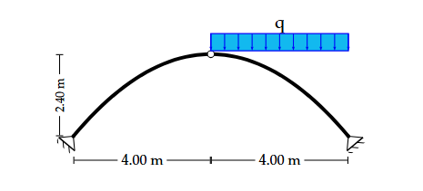

# Арки (Arch)

> Источник: [`docs.sympy.org/latest/modules/physics/continuum_mechanics/arches.html`](https://docs.sympy.org/latest/modules/physics/continuum_mechanics/arches.html)

Данный класс используется для решения задач, связанных с трёхшарнирной аркой (статически определимой конструкцией).

Арка — это криволинейная вертикальная конструкция, перекрывающая пространство под собой.

Арки могут применяться для снижения изгибающих моментов в большепролётных сооружениях.

В строительной механике арки применяются в проёмах окон, дверей и даже мостов, так как способны воспринимать значительные нагрузки, приложенные сверху.

