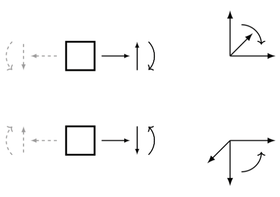

# 1. Балки (Beam)

> Источник: [`docs.sympy.org/latest/modules/physics/continuum_mechanics/beam.html`](https://docs.sympy.org/latest/modules/physics/continuum_mechanics/beam.html)

Этот модуль может использоваться для решения двумерных задач изгиба балок с сингулярными функциями в механике.

```python
class sympy.physics.continuum_mechanics.beam.Beam(
    length,
    elastic_modulus,
    second_moment,
    area=A,
    variable=x,
    base_char='C',
    ild_variable=a,
)
```

Балка — это конструктивный элемент, способный выдерживать нагрузку, главным образом, за счет сопротивления изгибу. Балки характеризуются профилем поперечного сечения (вторым моментом инерции), длиной и материалом, из которого они изготовлены.

**Примечание:**

> При решении задачи изгиба балки необходимо использовать согласованную систему знаков; результаты автоматически будут соответствовать выбранной системе знаков. Однако выбранная система знаков должна учитывать правило, согласно которому на положительной стороне оси балки (относительно текущего сечения) нагрузка, вызывающая положительную поперечную силу, приводит к отрицательному моменту, как показано ниже (изогнутая стрелка показывает положительный момент и угол поворота)

