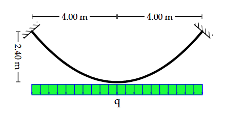

# 4. Нити (Cable)

> Источник: [`docs.sympy.org/latest/modules/physics/continuum_mechanics/cable.html`](https://docs.sympy.org/latest/modules/physics/continuum_mechanics/cable.html)

Данный модуль предназначен для решения задач, связанных с плоскими вантовыми системами.

Нити (канаты) — это инженерные конструкции, которые воспринимают приложенные поперечные нагрузки за счёт сопротивления растяжению, возникающего в их элементах.

Системы нитей широко используются в висячих мостах, морских платформах с натяжными опорами, линиях электропередач, а также находят применение во многих других областях техники.

