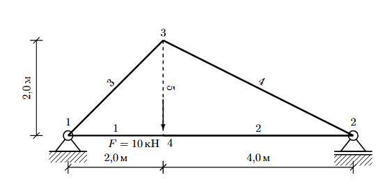

# 3. Фермы (Truss)

> Источник: [`docs.sympy.org/latest/modules/physics/continuum_mechanics/truss.html`](https://docs.sympy.org/latest/modules/physics/continuum_mechanics/truss.html)

Этот модуль используется для решения задач, связанных с двумерными фермами.

```python
class sympy.physics.continuum_mechanics.truss.Truss
```

**Ферма** — это конструкция, состоящая из стержней, соединённых в узлах, образующих жёсткую структуру. В инженерных приложениях ферма — это конструкция, состоящая только из элементов, работающих на растяжение или сжатие.

Фермы широко используются в инженерных приложениях и встречаются во многих реальных конструкциях, таких как мосты.



```python
from sympy.physics.continuum_mechanics.truss import Truss
t = Truss()
t.add_node(("node_1", 0, 0), ("node_2", 6, 0), ("node_3", 2, 2), ("node_4", 2, 0))
t.add_member(("member_1", "node_1", "node_4"), ("member_2", "node_2", "node_4"), ("member_3", "node_1", "node_3"))
t.add_member(("member_4", "node_2", "node_3"), ("member_5", "node_3", "node_4"))
t.apply_load(("node_4", 10, 270))
t.apply_support(("node_1", "pinned"), ("node_2", "roller"))
```
